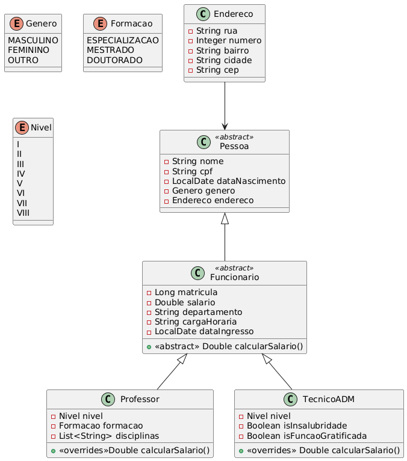

# Sistema de Gerenciamento de Empregados da Empresa IMDCorp

## Funcionalidades e Características

O sistema a ser desenvolvido deve ser capaz de criar e gerenciar empregados da empresa IMDCorp.

## Diagrama de classe do modelo do sistema

### Classe BancoDAO

Crie uma classe chamada `BancoDAO` (singleton) que armazene e gerencie um `ArrayList` do tipo `Funcionario`:

- **ArrayList<Funcionario`> funcionario**

Dentro dessa classe, crie os seguintes métodos públicos:

- `ArrayList<Funcionario> getArrayFuncionario()`
- `BancoDAO getIntance()`

### Classe Operacoes

- `cadastrarProfessor()` - Cadastra um novo professor. Recebe com parâmetro o objeto Professor, o adiciona ao ArrayList de funcionários, exibe da console o resultado da operação e retorna o objeto Professor;
- `cadastrarTecnicoADM()` - Cadastra um novo tecnicoADM. Recebe com parâmetro o objeto TecnicoADM, o adiciona ao ArrayList de funcionários, exibe da console o resultado da operação e retorna o objeto TecnicoADM;
- `listarProfessores()` - Lista todos os professores por nome e disciplina. Exibe todos os professores cadastrados no console, caso não haja professores cadastrados, exibe uma mensagem informando que não há professores cadastrados;
- `listarTecnicosADM()` - Lista todos os técnicos ADM por nome e função. Exibe todos os técnicos ADM cadastrados no console, caso não haja técnicos ADM cadastrados, exibe uma mensagem informando que não há técnicos ADM cadastrados;
- `excluirProfessor(Long matricula)` - Apaga um professor a partir de sua matrícula. Faz a busca do professor a partir da matrícula passada como parâmetro, caso o professor seja encontrado, exibe uma mensagem informando que o professor foi excluído, caso não seja encontrado, exibe uma mensagem informando que o professor não foi encontrado;
- `excluirTecnicoADM(Long matricula)` - Apaga um Técnico ADM a partir de sua matrícula. Faz a busca do Técnico ADM a partir da matrícula passada como parâmetro, caso o Técnico ADM seja encontrado, exibe uma mensagem informando que o Técnico ADM foi excluído, caso não seja encontrado, exibe uma mensagem informando que o Técnico ADM não foi encontrado;
- `buscarProfessor(Long matricula)` - Localiza e exibe um professor a partir de uma matrícula passada como parâmetro. Busca o professor a partir da matrícula passada como parâmetro, caso o professor seja encontrado, exibe as informações do professor, caso não seja encontrado, exibe uma mensagem informando que o professor não foi encontrado;
- `buscarTecnicoADM(Long matricula)` - Localiza e exibe um Técnico ADM a partir de uma matrícula passada como parâmetro. Busca o Técnico ADM a partir da matrícula passada como parâmetro, caso o Técnico ADM seja encontrado, exibe as informações do Técnico ADM, caso não seja encontrado, exibe uma mensagem informando que o Técnico ADM não foi encontrado;
- `exibirSalarioProfessor()`: Exibe o salário de um professor a partir de sua matrícula. Busca o professor a partir da matrícula passada como parâmetro, caso o professor seja encontrado, exibe o salário do professor, caso não seja encontrado, exibe uma mensagem informando que o professor não foi encontrado;
- `exibirSalarioTecnicoADM()`: Exibe o salário de um Técnico ADM a partir de sua matrícula. Busca o Técnico ADM a partir da matrícula passada como parâmetro, caso o Técnico ADM seja encontrado, exibe o salário do Técnico ADM, caso não seja encontrado, exibe uma mensagem informando que o Técnico ADM não foi encontrado;

### Base Salarial

- **Professor**: R$ 4.000,00  
- **Técnico**: R$ 2.500,00  

#### Regras de Cálculo por Tipo de Colaborador

#### **1. Professor**

1. **Adicional por Nível**:
   - A cada nível, acrescentar **5%** sobre o valor do nível anterior.
2. **Adicional por Formação Acadêmica**:
   - **Especialização**: +25% sobre o salário base.  
   - **Mestrado**: +50% sobre o salário base.  
   - **Doutorado**: +75% sobre o salário base.  

#### **2. Técnico**

**Salário Base (Padrão para o Nível 1)**: R$ 2.500,00  

1. **Adicional por Nível**:

   - A cada nível, acrescentar **3%** sobre o valor do nível anterior.
2. **Adicional por Formação Acadêmica**:
   - **Especialização**: +25% sobre o salário base.  
   - **Mestrado**: +50% sobre o salário base.  
   - **Doutorado**: +75% sobre o salário base.  
3. **Adicionais Específicos do Técnico**:
   - **Insalubridade**: +50% sobre o salário base.  
   - **Função Gratificada**: +50% sobre o salário base.  

## Como Executar o Código

1. Clone o repositório.
2. Abra o projeto em sua IDE.
3. Execute o arquivo `Main.java`.
4. Siga as instruções exibidas no console.
   1. Nele você poderá executar operações funcionais do sistema, como:
      - Cadastrar um professor.
      - Cadastrar um técnico ADM.
      - Listar professores.
      - Listar técnicos ADM.
      - Excluir um professor.
      - Excluir um técnico ADM.
      - Buscar um professor.
      - Buscar um técnico ADM.
      - Exibir o salário de um professor.
      - Exibir o salário de um técnico ADM.

## Atividades Gerais do Sistema

- Essas informações devem ser armazenadas em um arquivo binário (use serialização de classes).
- Ao abrir o programa, faça a leitura dos dados e, ao concluir o programa, salve no arquivo.
- Crie no mínimo 10 professores e 10 técnicos ADM (20 funcionários).
- Crie um menu interativo, via console, no qual é possível escolher qual função chamar.
- O código deve ser modularizado, com todas as classes em pacotes/pastas próprias.

## Critérios de Avaliação

- Código corretamente modularizado (1,0);
- Informações salvas nos arquivos (1,0);
- Utilização da herança, interfaces, collections, Date (2,0);
- Uso do singleton (1,0);
- Implementação correta de todos os métodos solicitados (2,0);
- Código organizado, comentado, de fácil entendimento e seguindo boas práticas (3,0).

## Entregáveis

O código deverá ser compactado em formato ZIP e enviado por meio do SIGAA (tarefa).

Na pasta compactada, inclua obrigatoriamente um arquivo **README.txt** explicando como executar o código e o funcionamento das funções.
**Atenção**: A ausência desse arquivo resultará em um desconto de **1,0 ponto** na nota.

### Nota Importante

O uso evidente de inteligência artificial (IA) na realização desta atividade acarretará redução na nota.
